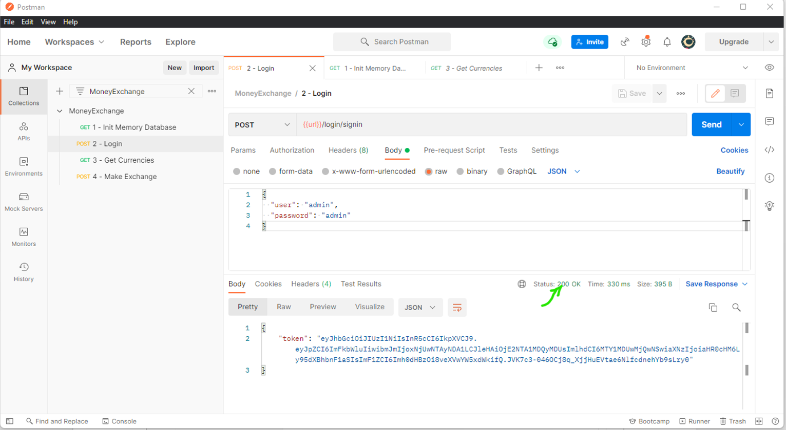
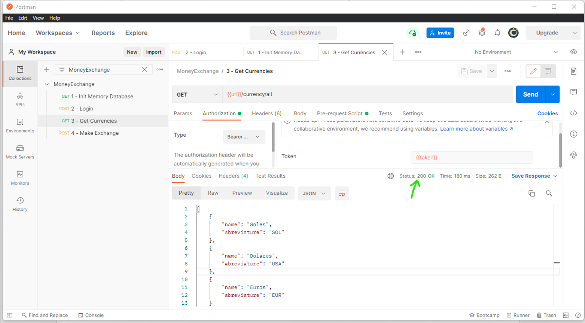

# Yup.MoneyExchange

En este reto se ha llegado utilizar diferentes patrones y librerias que mueven la comunidad de dotnet.

A continuación se mencionara alguna de ellas:
- Se esta usando .NET 6 con C# 10 en Visual studio 2022, la api esta corriendo en contenedores linux `mcr.microsoft.com/dotnet/aspnet:6.0.`
- La estructura de proyecto esta basado en CleanArchitecture, un arquetipo que organiza entidades de dominio, persistencia y logica de negocio. 
    > Modern-web-apps https://docs.microsoft.com/en-us/dotnet/architecture/modern-web-apps-azure/common-web-application-architectures#clean-architecture
- Se hace uso del patrón mediador para el manejo de CQRS (Command and Query Responsibility Segregation), para organizar los comandos y queries en el proyecto, con el objetivo de que sea más limpio el proyecto, separar lógica de lectura y escritura, y no tener clases gigantes que contengan lógica de negocio.

    > Uso de la libreria https://github.com/jbogard/MediatR
- Para la persistencia se esta usando EntityFramework Core 6 con el storage InMemoryDatabase.
    ```C#
    services.AddDbContext<DbContext, ExchangeDbContext>(options =>
            options
                .UseInMemoryDatabase(databaseName: "Exchange")
                .EnableSensitiveDataLogging(IsDevelopment)

            );
    ```
- Se  esta usando Swagger, una herramienta que nos sirve para documentar la api bajo la especificación de Open Api 3.0.
    
- Para la autenticación se ha creado un endpoint basico `'/login/signin'` que nos devolverá un token en base a un usuario y contraseña.

- Para la autenticación del token, se esta haciendo uso del middleware de AspNetCore, que permite validar si el token es válido.
    ```C#
    app.UseAuthentication();
    ...
    services.AddAuthentication(JwtBearerDefaults.AuthenticationScheme)
            .AddJwtBearer(JwtBearerDefaults.AuthenticationScheme, options =>
           {
               options.RequireHttpsMetadata = false;
               options.TokenValidationParameters = new TokenValidationParameters
               {
                   ValidateIssuerSigningKey = true,
                   IssuerSigningKey = signingKey,
                   ValidateIssuer = true,
                   ValidIssuer = authConfig.Issuer,
                   ValidateAudience = true,
                   ValidAudience = authConfig.Audience,
                   ValidateLifetime = true,
                   ClockSkew = TimeSpan.Zero,
                   RequireExpirationTime = true,
               };
               options.Events = new JwtBearerEvents()
               {
                       //Evento para saber el detalle de un 401 (No Authorize), token invalido? token expirado?
                       OnAuthenticationFailed = context =>
                       {
                           ...
                       }
               };
           });
    ```

- Para la autorización, se han asignado los atributos `[Authorize]` a los controllers para no permitir su acceso si es que no tiene un token válido.
    ```C#
    namespace Yup.MoneyExchange.Api.Controllers;

    [Authorize]
    [ApiController]
    [Route("[controller]")]
    public class ExchangeController : ControllerBase
    ```

## Funcionalidades requeridas

1. **Creacion del API.**

    
    ```bash
    dotnet run Yup.MoneyExchange.Api
    ```
1. **Funcionalidad de cambio de moneda.**

    La funcionalidad de encuentra en el comando MakeExchangeCommand.
    [src/Yup.MoneyExchange.Application/Exchanges/Commands/MakeExchangeCommand.cs](src/Yup.MoneyExchange.Application/Exchanges/Commands/MakeExchangeCommand.cs)

1. **Uso de InMemoryDatabase.**

    Uso del storage de EF Core en memoria.
    ```C#
    services.AddDbContext<DbContext, ExchangeDbContext>(options =>
            options
                .UseInMemoryDatabase(databaseName: "Exchange")
                .EnableSensitiveDataLogging(IsDevelopment)

            );
    ```

1. **Dockerizar el api e invocarlo desde Postman**

    Para dockerizar la api se ha creado un Dockerfile, que contiene el paso a paso para crear la imagen del api.
    [src\Yup.MoneyExchange.Api\Dockerfile](src/Yup.MoneyExchange.Api/Dockerfile)
    Evidencia:
    

    

    

1. **Uso del api mediante Postman.**

    Evidencia:

    - Crearemos las variables a usar en la collección.
      

    - Inicializaremos la base de datos en memoria con carga inicial de monedas.
      
 
    - Llamaremos al endpoint de login con un usuario y contraseña cualquiera para retornar el token.
      

    - Podremos ver las monedas registradas por el InitDatabase.
      

    - Obtenemos los tipos de cambio registrados en la base de datos.
      

    - Crearemos un nuevo tipo de cambio con las monedas de origen y destino.
      

    - Podremos ver el nuevo tipo de cambio ingresado.
      

    - Aplicar un tipo de cambio a un monto.
      

    - Actualizar el tipo de cambio de una moneda origen/destino
      

## Funcionalidades opcionales
1. **Agregar un nivel de seguridad (token).**

    Se agrego el middleware de authenticacion para validar el token de entrada.
    ```C#
    app.UseAuthentication();
    ...
    services.AddAuthentication(JwtBearerDefaults.AuthenticationScheme)
            .AddJwtBearer(JwtBearerDefaults.AuthenticationScheme, options =>
           {
               options.RequireHttpsMetadata = false;
               options.TokenValidationParameters = new TokenValidationParameters
               {
                   ValidateIssuerSigningKey = true,
                   IssuerSigningKey = signingKey,
                   ValidateIssuer = true,
                   ValidIssuer = authConfig.Issuer,
                   ValidateAudience = true,
                   ValidAudience = authConfig.Audience,
                   ValidateLifetime = true,
                   ClockSkew = TimeSpan.Zero,
                   RequireExpirationTime = true,
               };
               options.Events = new JwtBearerEvents()
               {
                       //Evento para saber el detalle de un 401 (No Authorize), token invalido? token expirado?
                       OnAuthenticationFailed = context =>
                       {
                           ...
                       }
               };
           });
    ```

    

    

    ```C#
    namespace Yup.MoneyExchange.Api.Controllers;

    [Authorize]
    [ApiController]
    [Route("[controller]")]
    public class ExchangeController : ControllerBase
    ```

    

1. **Crear un PUT para actualizar el tipo de cambio.**

    

1. **Implementar un front con angular.**

    En progreso...
